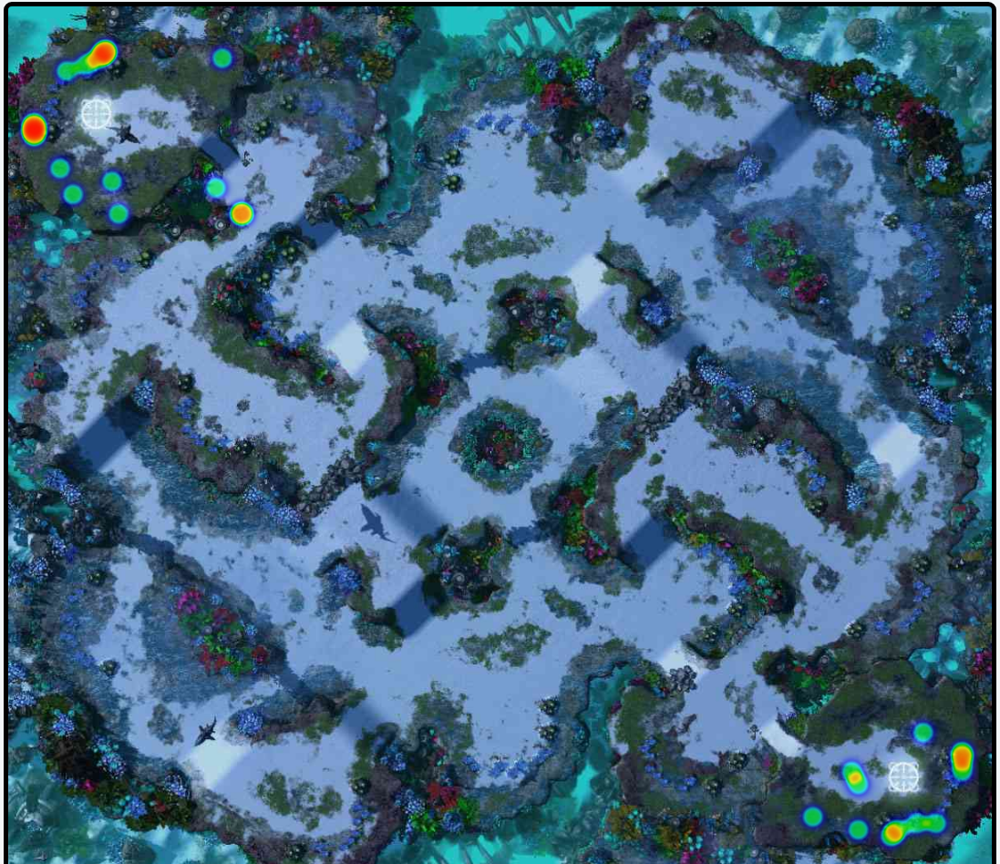

Tournament Heatmaps
-------------------

Create a heatmap of locations on top of a minimap image. Example:

WCS Valencia 2017: For abyssal, show stargate locations.

map pool
--------

Map Name              Count (playoffs only)

Abyssal Reef LE       26
Ascension to Aiur LE  17
Blood Boil LE          6
Defender's Landing LE  7
Odyssey LE            20
Proxima Station LE    22
Sequencer LE          18

Source: http://wiki.teamliquid.net/starcraft2/2017_WCS_Valencia#Map_Statistics

map count
---------

391 Replays in the WCS Valencia archive

Source: https://wcs.starcraft2.com/en-us/news/20938027/WCS-Valencia-2017-Replays-Available!/

Abyssal Reef
------------

http://wiki.teamliquid.net/starcraft2/Abyssal_Reef_LE

